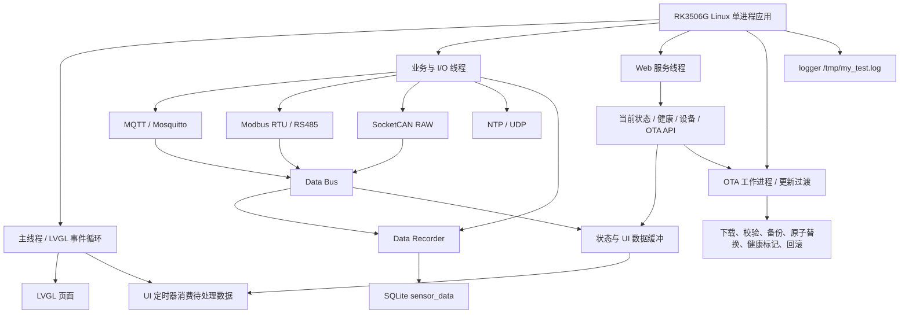

# Linux 环境监测与边缘网关项目面试知识库

> 项目名称：`my_test` / Environment Monitor
> 文档用途：AI 面试助手、项目复盘、技术面试准备
> 文档基线：当前项目源码与当前配置
> 项目目录：`D:\rk3506WG-main\rk3506WG-main`
> 代码责任：根据本人确认，项目全部工作由本人独立完成。
> 当前版本基线：`3.1.4`

---

## 0. 文档使用规则

本文只描述当前代码能够证明的内容。为避免面试时把规划或残留接口误说成产品能力，使用以下标记：

| 标记 | 含义 |
|---|---|
| 已实现 | 当前源码中有可追踪的实现和调用链 |
| 已修复 | 原有问题已经在当前代码中完成修复，并能从源码看到修复方式 |
| 已移除 | 曾存在误导性占位或未完成能力，当前已从产品描述中去掉 |
| 风险 | 当前代码仍存在边界、部署约束或未验证项 |
| 待补证据 | 代码中没有足够证据，面试时不应扩展为确定结论 |

“代码中存在函数”不等于“产品功能已接通”。例如数据库历史查询函数存在，但 Web 历史路由已经去掉，因此不能宣传为“Web 已实现完整历史查询”。

---

## 1. 项目基本信息

### 1.1 项目是什么

这是一个运行在 RK3506G Linux 设备上的嵌入式环境监测与边缘数据网关程序，主要完成：

- 通过 MQTT 接收和发布温湿度数据；
- 通过 Modbus RTU 轮询 RS485 设备；
- 通过 SocketCAN 接收 CAN 原始帧并解析信号；
- 通过 SQLite 批量保存传感器历史数据；
- 通过 LVGL + DRM/evdev 提供设备本地界面；
- 通过轻量 HTTP 服务提供当前状态、设备状态和 OTA 控制接口；
- 通过 NTP 进行设备时间同步；
- 通过 OTA 下载、校验、原子替换和回滚更新应用；
- 通过日志、健康接口和状态接口支持运行维护。

它是一个单进程、多线程的嵌入式应用，不是 systemd 服务文件、守护进程管理器或容器化服务。正常运行时由一个主进程承载 UI、业务服务线程和后台 I/O 线程；OTA 更新过程会临时使用 `fork/exec` 启动新应用，这是更新过渡流程，不是常驻多进程架构。

### 1.2 运行环境

| 项目 | 当前证据 |
|---|---|
| 目标平台 | RK3506G Linux，目标分支默认使用 ARM 交叉编译器 |
| ARM 编译选项 | `-march=armv7-a -mfloat-abi=hard -mfpu=neon` |
| 语言标准 | C11 |
| 构建系统 | CMake，当前以 `CMakeLists.txt` 为唯一构建入口 |
| 目标输出 | `my_test` |
| 主机模拟输出 | `my_test_sim` |
| UI | LVGL；目标平台使用 DRM/evdev，主机使用 SDL2 |
| 消息协议 | MQTT，Mosquitto 客户端库 |
| 数据库 | SQLite |
| 配置解析 | cJSON |
| 网络 | POSIX socket；HTTP 使用 TCP，NTP 使用 UDP，MQTT 由 Mosquitto 处理 |
| 设备总线 | RS485/Modbus RTU、SocketCAN RAW |

### 1.3 当前版本和配置证据

主要证据文件：

- `/D:\rk3506WG-main\rk3506WG-main\app_config.h`：应用版本、MQTT、HTTP、数据库、NTP、OTA、日志、Modbus、CAN 默认配置；
- `/D:\rk3506WG-main\rk3506WG-main\CMakeLists.txt`：主机模拟和 ARM 目标构建分支；
- `/D:\rk3506WG-main\rk3506WG-main\main.c`：程序启动、服务初始化、主循环和清理；
- `/D:\rk3506WG-main\rk3506WG-main\README.md`：当前项目说明和构建边界；
- `/D:\rk3506WG-main\rk3506WG-main\www\index.html`：Web 页面版本展示。

当前应用版本已经统一为 `3.1.4`。旧的 `build_host` 目录属于历史生成物，不能作为当前源代码版本证据；重新排查时应使用干净构建目录。

---

## 2. 一页项目介绍

### 2.1 面试开场版

我独立完成了一个运行在 RK3506G Linux 上的环境监测与边缘网关应用。它采用 C11 和 CMake 构建，主进程中包含 LVGL 本地界面、MQTT、Modbus RTU、SocketCAN、SQLite、HTTP、NTP 和 OTA 等模块。

项目的关键难点不是单一协议接入，而是多个 I/O 线程与 UI、数据总线、数据库之间的并发协作。我对数据总线采用“锁内只做订阅快照、锁外执行回调”的方式，修复了回调持锁导致的阻塞和重入死锁风险；对 LVGL 采用“后台线程只投递数据、主线程统一更新对象”的方式；对数据记录器采用锁内整理批次、提交数据库事务、避免递归申请同一把锁的方式。

在 OTA 方面，我去掉了依赖 shell 脚本切换文件的方式，改为下载文件校验 SHA-256、备份旧文件、写临时文件并 `fsync`、原子 `rename`、启动新应用、健康标记和超时回滚。当前项目已经去掉未完成的 Web 历史查询、虚假的 Modbus/CAN 控件和不存在的扫描能力，文档只保留源码能够证明的功能。

### 2.2 项目亮点

1. 多协议数据接入：MQTT、Modbus RTU、SocketCAN、NTP、HTTP。
2. 面向嵌入式的线程协作：数据总线、原始帧队列、UI 主线程更新、停止和回收路径。
3. 数据持久化：SQLite 表结构、索引、批量写入和事务提交。
4. OTA 可靠性：校验、备份、临时文件、原子替换、健康标记、回滚。
5. 边界诚实：未接通的 Web 历史查询、认证、TLS、完整压力测试和目标板运行结果不写成已完成能力。

---

## 3. 项目范围和能力边界

### 3.1 已实现并有调用链的功能

| 能力 | 实现范围 | 证据 |
|---|---|---|
| MQTT | 初始化、认证配置、异步连接、订阅、发布、断线重连状态 | `services/mqtt_client.c`、`main.c` |
| 温湿度数据 | MQTT JSON 解析；字段 `temperature`、`humidity`，可选 `valid` | `services/mqtt_client.c`、`main.c` |
| Data Bus | 订阅、发布、回调快照、锁外回调 | `services/data_bus.c`、`services/data_bus.h` |
| SQLite 记录 | 建表、索引、批量事务插入、失败保留缓冲 | `database.c`、`services/data_recorder.c` |
| Modbus RTU | 手工构造请求、RS485 收发、CRC 校验、响应校验、数据发布 | `services/modbus_master.c`、`hal/rs485_uart.c` |
| SocketCAN | RAW CAN socket、接口配置、接收、信号解析、数据发布 | `hal/can_socket.c`、`services/can_manager.c` |
| LVGL UI | MQTT、Modbus、CAN、OTA 四个页面；主线程更新 UI | `main.c`、`ui/` |
| HTTP | 当前传感器、系统、健康、状态、设备、OTA 和静态页面 | `web_server.c`、`web/` |
| NTP | UDP 请求、服务器列表、超时、周期同步、状态 | `ntp_sync.c` |
| OTA | 应用下载、SHA-256、备份、原子安装、健康标记、回滚 | `ota_manager.c`、`web/api_ota_web.c` |
| 日志 | 控制台和文件日志，1 MiB 后保留一个 `.1` 备份 | `infra/logger.c` |
| 资源清理 | 停止服务、关闭设备、回收线程、释放 DRM/LVGL 相关资源 | `main.c`、各服务模块、`hal/display_drm.c` |

### 3.2 已明确去掉或不应宣传的能力

- Web 历史数据接口：已移除未连接真实数据库查询的路由；数据库查询函数本身保留，但当前没有形成 Web 产品链路。
- Modbus “Scan Bus”：无实现证据，不作为功能描述。
- Modbus “Read Regs”：无完整 UI 产品链路，不作为功能描述。
- CAN “Auto:ON”：无实现证据，不作为功能描述。
- CAN UI “Set Filter”：当前没有对应 UI 控件链路，不作为功能描述。
- 虚假的随机数据、模拟寄存器结果和占位状态：已从产品描述和 UI 控件中移除。
- HTTPS、HTTP 认证、Token、TLS MQTT：当前默认代码没有完成这些能力，不作为安全特性宣传。
- systemd 服务单元、Docker 镜像、IPC 队列/共享内存/管道：当前仓库没有证据，不作为部署或架构能力宣传。

---

## 4. 总体架构

### 4.1 架构分层



### 4.2 线程和职责

| 执行单元 | 主要职责 | 共享数据保护 |
|---|---|---|
| 主线程 | 初始化、LVGL 事件循环、定时器、UI 更新、退出清理 | UI 对象只由主线程操作；读取待处理数据时使用对应锁 |
| MQTT 线程 | Mosquitto 网络循环、连接状态、订阅和消息回调 | MQTT 状态使用原子变量；消息进入 Data Bus |
| Modbus 线程 | 周期发送 RTU 请求、读取响应、CRC 和响应校验 | Modbus 运行状态使用原子变量，串口收发使用锁 |
| CAN 接收线程 | `select` 等待 SocketCAN 帧、解析并发布 | 原始帧和信号结果进入主线程待处理缓冲 |
| Data Recorder 线程 | 接收记录请求、定时或满批次刷入 SQLite | 记录缓冲使用 `rec_mutex`；刷库使用批量事务 |
| HTTP 监听线程 | `accept` TCP 客户端、限制并发数 | 活跃连接计数、停止状态和条件变量受锁保护 |
| HTTP 客户端线程 | 读取有限大小请求、路由、发送响应 | 不直接操作 LVGL；访问共享 Web 数据时使用锁 |
| NTP 线程 | UDP 时间同步和周期等待 | 运行状态和同步状态使用原子/互斥保护 |
| Watchdog 线程 | 喂狗和停止处理 | 运行状态使用原子变量，停止时先 join 再关 fd |
| OTA 工作进程 | 下载、校验、安装、启动新应用、回滚 | 更新状态使用 OTA 锁；更新过程使用文件同步和标记文件 |

### 4.3 进程模型

正常启动流程只有一个应用进程，内部创建多个线程。当前没有证据表明应用由 systemd、Supervisor 或其他服务管理器拉起，也没有 PID 文件、daemonize 或容器入口脚本。

OTA 更新时，当前应用会通过 `fork/exec` 启动新应用并进入更新切换流程。旧应用不等待新应用长期运行，这是更新交接行为，不应描述为日常业务采用多进程架构。

---

## 5. 启动、运行和退出流程

### 5.1 启动流程

`main.c` 的核心顺序可以概括为：

1. 注册 `SIGINT`、`SIGTERM` 退出信号处理；
2. 初始化日志；
3. 初始化配置、数据库、Data Bus 和数据记录器；
4. 初始化显示、触摸、LVGL 和页面；
5. 初始化 MQTT、Modbus、CAN、NTP、HTTP、Watchdog 等服务；
6. 配置 MQTT 认证信息；
7. 启动 MQTT 网络循环和各业务线程；
8. 进入 LVGL 主循环和定时器调度；
9. 主循环将后台线程投递的 CAN/传感器状态应用到 UI。

MQTT 的认证顺序已经调整为：

```text
mqtt_client_init()
    -> mqtt_client_set_auth()
    -> mqtt_client_start()
```

这样可以确保第一次异步连接时已经配置用户名和密码，而不是先连接后设置认证。

### 5.2 退出流程

`main.c` 的 `app_cleanup()` 负责按顺序取消 OTA、停止 CAN/Modbus/MQTT/NTP/HTTP/Data Recorder、停止 Watchdog、关闭触摸和显示、关闭日志等。

重点约束：

- 停止线程前先改变运行状态；
- 对可 join 的线程先停止、再 `join`；
- HTTP 服务停止时等待活跃客户端退出；
- Watchdog 在关闭 fd 前先 join；
- DRM 显示退出时释放 mmap、RMFB、资源对象并关闭 fd；
- RS485 关闭路径与读写路径使用同一把锁保护；
- 数据库刷盘失败时不能提前清除内存缓冲。

---

## 6. 数据链路和模块说明

### 6.1 MQTT 数据链路

当前配置证据：

- Broker：`192.168.5.10`；
- 端口：`1883`；
- 主题：`esp32c6/sensor`；
- Keepalive：`60` 秒；
- 默认用户名和密码宏为空；
- 当前未配置 TLS。

接收链路：

```text
Mosquitto 网络循环
    -> MQTT 消息回调
    -> cJSON 解析 temperature / humidity / valid
    -> Data Bus 发布
    -> UI 状态缓冲 / Data Recorder / 其他订阅者
```

发布链路：

```text
UI 或业务逻辑
    -> 生成 {"temp": ..., "humi": ...}
    -> MQTT publish
    -> QoS 1
```

当前 MQTT 模块使用异步连接和重连状态，重连间隔配置为 `5/10/30/60` 秒。认证设置必须发生在 `mqtt_client_start()` 之前。

面试边界：当前代码没有足够证据证明 TLS、离线消息持久化、QoS 端到端投递保证或生产环境认证策略已经完成。

### 6.2 Data Bus

Data Bus 提供模块间数据解耦。发布时采用以下策略：

1. 在互斥锁内读取有效订阅者并复制到本地回调快照；
2. 释放互斥锁；
3. 在锁外逐个执行回调。

这样做可以避免：

- 一个慢回调阻塞订阅、取消订阅和其他发布者；
- 回调再次访问 Data Bus 时递归申请同一把锁；
- Modbus、CAN 或 MQTT 线程被 UI/数据库回调长时间拖住。

当前还保留两个设计边界：订阅槽位上限为固定数量，动态频繁订阅/取消订阅可能耗尽槽位；一次发布已经快照的回调可能在取消订阅后仍执行一次。项目当前没有动态订阅压力测试证据。

### 6.3 SQLite 和数据记录器

数据库文件默认是 `sensor_data.db`，核心表为 `sensor_data`，包含：

- `id`；
- `timestamp`；
- `temperature`；
- `humidity`；
- `valid`。

时间字段有索引。`device_data` 表及数据库查询/统计函数存在，但当前没有完整的产品调用链，不能据此宣传设备历史 Web 查询。

数据记录器默认：

- 最大批次：120 条；
- 刷盘间隔：60 秒；
- 数据保留配置：30 天；
- 使用 `BEGIN IMMEDIATE`、批量插入和提交事务。

记录器的关键修复是把真正执行刷盘的逻辑拆为 `data_recorder_flush_locked()`。`data_recorder_record()` 已经持有 `rec_mutex` 时直接调用锁内版本，不再调用会再次申请同一把锁的公开 `data_recorder_flush()`，因此消除了原来的递归加锁死锁路径。

只有事务提交成功后才清空已写入的记录；如果数据库写入失败，缓冲会保留，以便后续重试。缓冲达到上限仍无法写入时，代码会按当前策略丢弃新记录，这是需要在产品层面明确的降级行为。

### 6.4 Modbus RTU / RS485

当前默认配置：

- 设备：`/dev/ttyS3`；
- 波特率：`9600`；
- 方向控制：GPIO0；
- 轮询周期：1000 ms；
- 主程序加入从站 `1`、功能码 `3`、起始地址 `0`、寄存器数量 `2`。

当前实现是手工 RTU/CRC16，不是 libmodbus 适配层。一次请求为地址、功能码、起始地址、数量和 CRC；响应会校验：

- 从站地址；
- 功能码；
- 异常响应；
- 响应长度；
- 字节数；
- CRC16。

RS485 串口读写和关闭使用锁保护，停止 Modbus 时会等待线程退出。

### 6.5 SocketCAN

当前 CAN 链路采用 Linux SocketCAN RAW：

```text
socket(PF_CAN, SOCK_RAW, CAN_RAW)
    -> bind can0
    -> select 等待帧，超时时间约 1 秒
    -> read can_frame
    -> 按信号表解析
    -> Data Bus 发布
    -> 主线程消费待处理帧/信号并更新 LVGL
```

默认配置：

- 接口：`can0`；
- 比特率：`500000`；
- 默认信号：CAN ID `0x123`，起始位 `0`，长度 `16`，比例 `0.25`，偏移 `0`，单位 `rpm`；
- 物理值公式：`raw * scale + offset`；
- 信号表上限：32 条。

CAN 接收回调不再直接调用 LVGL。后台线程只写原始帧和解析结果到受锁保护的待处理缓冲，主线程定时器再读取缓冲并更新页面，避免 LVGL 对象被后台线程并发访问。

`hal/can_socket.c` 中仍有用于配置 CAN 接口的 `system()` 调用。当前命令参数来自编译期配置，而不是 HTTP 或 MQTT 外部输入，因此目前未发现直接外部命令注入链路；但如果以后改为外部可配置，必须改为直接系统调用或严格白名单校验。

### 6.6 LVGL 本地 UI

当前页面：

1. MQTT 页面：显示连接状态、温湿度和发布入口；
2. Modbus 页面：显示轮询状态和已配置设备数据；
3. CAN 页面：显示接收状态、原始帧/信号数据；
4. OTA 页面：显示版本、检查、下载和更新状态。

目标平台通过 DRM/evdev 初始化显示和输入；主机模拟通过 SDL2。所有 LVGL 对象更新集中在主线程或其定时器回调中。后台线程不能直接访问 LVGL 对象。

主机模拟中的硬件、网络、数据库、OTA 等 stub 只能用于编译和有限逻辑验证，不能据此证明目标板驱动和真实设备运行正常。

### 6.7 HTTP 服务

HTTP 服务采用 POSIX TCP socket：

- 监听地址：`INADDR_ANY`；
- 默认端口：8080；
- HTTP/1.0 明文；
- 一个监听线程加 detached 客户端线程；
- 活跃客户端上限：10；
- 单请求缓冲上限：4096 字节；
- 支持 `Content-Length`；
- 接收超时：约 5 秒；
- 超过请求上限返回 413；
- 发送采用循环写，避免短写导致响应截断。

当前路由：

| 路径 | 用途 |
|---|---|
| `/` | 静态首页 |
| `/api/sensor/current` | 当前传感器数据 |
| `/api/system/info` | 系统信息 |
| `/api/health` | 健康状态 |
| `/api/status` | 服务状态 |
| `/api/device/list` | 设备列表 |
| `/api/device/modbus` | Modbus 当前数据/控制接口范围 |
| `/api/device/can` | CAN 当前数据/控制接口范围 |
| `/api/ota/check` | OTA 检查 |
| `/api/ota/status` | OTA 状态 |
| `/api/ota/start` | OTA 启动 |

HTTP 解析已经从一次接收、简单字符串查找增强为有请求上限、请求体长度处理、超时、客户端数量限制和发送完整性处理，但它仍不是完整的 HTTP/1.1 服务器。当前没有认证、授权、HTTPS、TLS、复杂分片请求处理和完整字段校验，因此监听在 `INADDR_ANY` 时必须视为受信网络部署能力，而不是安全 Web 服务。

### 6.8 NTP

NTP 模块使用 UDP socket 向配置的时间服务器发送请求，接收超时约 5 秒，线程启动时执行一次同步，之后按约 3600 秒周期执行。设置系统时间需要相应权限，代码注释已经标明该约束。

NTP 运行状态和同步状态经过原子变量/互斥保护，停止时会唤醒或等待线程退出并完成 join。

### 6.9 OTA

当前 OTA 只支持应用类型 `OTA_TYPE_APP`。默认配置包括：

- OTA 服务 URL：`http://192.168.5.128:9090`；
- 当前应用路径：`/oem/my_test`；
- 下载临时文件：`/tmp/my_test_new`；
- 健康标记：`/tmp/ota_ok`；
- 最大下载大小：16 MiB；
- 最大重试次数：3；
- 下载连接、读写超时；
- SHA-256 校验；
- 可选签名校验回调，但默认没有配置签名实现；
- 可选 bspatch 差分工具路径。

安装流程：

```text
检查版本
    -> 下载到临时文件
    -> 校验长度 / SHA-256 / 可选签名
    -> 备份旧应用
    -> fsync 临时文件
    -> 原子 rename 到应用路径
    -> fsync 父目录
    -> fork/exec 启动新应用
    -> 新应用写健康标记
    -> 等待健康窗口
    -> 成功保留新版本；失败恢复备份并重启
```

当前已经去掉 OTA 通过 `system()` 执行更新脚本、`cp`、`killall` 和系统重启命令的方式，改用直接文件操作、`fork/exec` 和 `reboot(RB_AUTOBOOT)`。临时文件、备份、原子替换、父目录同步和健康标记降低了文件损坏及失败更新风险，但 OTA 默认仍为明文 HTTP，且默认没有签名校验，不能宣称为完整安全升级方案。

---

## 7. 并发模型与关键问题修复

### 7.1 数据记录器死锁风险

原问题：`data_recorder_record()` 持有 `rec_mutex` 时调用公开的 `data_recorder_flush()`，后者再次申请同一把非递归互斥锁。缓冲写满时可能永久阻塞，进而影响 MQTT 回调和数据记录。

当前修复：

- 增加 `data_recorder_flush_locked()` 内部函数；
- 已持锁路径只调用锁内函数；
- 对外公开的 `data_recorder_flush()` 负责申请锁后再调用锁内函数；
- SQLite 使用批量事务；
- 事务失败不提前清除内存记录。

证据：`services/data_recorder.c` 中的 `data_recorder_record()`、`data_recorder_flush_locked()`、`data_recorder_flush()`；`database.c` 中的 `database_insert_records()`。

### 7.2 Data Bus 锁内回调

原问题：发布时在互斥锁保护范围内直接执行回调，慢回调会阻塞其他访问，回调重入 Data Bus 时可能死锁。

当前修复：

- 锁内只复制有效回调到本地数组；
- 立刻解锁；
- 锁外调用回调。

这使回调执行时间不再直接占用 Data Bus 内部锁，但回调本身仍需避免长时间阻塞。

证据：`services/data_bus.c` 的 `data_bus_publish()`。

### 7.3 LVGL 后台线程访问

原问题：CAN 回调可能直接从接收线程更新 LVGL 对象，存在并发访问、状态异常、内存破坏和随机崩溃风险。

当前修复：

- CAN 回调只保存原始帧和解析信号；
- 使用互斥锁保护待处理缓冲；
- `timer_1s_cb()` 在主线程中消费数据；
- LVGL 对象只在主线程更新。

同一原则应用于传感器状态和其他后台服务状态：后台线程更新业务数据，主线程负责 UI 对象操作。

### 7.4 跨线程状态变量同步

原问题：MQTT、OTA、Modbus、CAN、NTP、HTTP 等运行状态此前存在有的加锁、有的无锁的混用，可能形成数据竞争。

当前修复：

- MQTT、Modbus、CAN、NTP、HTTP、Watchdog 运行标志使用原子变量或明确的状态锁；
- OTA 状态和进度使用 OTA 锁；
- Web 共享数据和活跃客户端计数使用 Web 锁；
- 主线程的传感器、CAN 原始帧和信号待处理数据使用专用锁；
- 停止路径遵循“改变状态 -> 唤醒/停止 -> join -> 释放资源”。

当前没有运行 ThreadSanitizer、Helgrind 或压力测试结果，因此只能确认源码层同步策略已经调整，不能宣称所有并发问题已通过动态工具证明不存在。

---

## 8. 数据、配置、日志和资源管理

### 8.1 配置解析

`storage/config_file.c` 当前使用 cJSON 解析有限大小的完整 JSON 文档，最大配置缓冲约为 8192 字节，并提供字符串、整数、浮点数和布尔值读取接口。字符串返回使用线程局部缓冲，避免多个线程共用同一个静态字符串缓冲。

仍需注意：

- 配置大小是固定上限；
- 字段缺失和格式错误有边界处理，但不是完整 schema 校验；
- 当前主要配置仍来自 `app_config.h` 的编译期宏；
- 没有证据证明所有运行参数都已经接入外部配置文件。

### 8.2 日志

日志默认写入：

```text
/tmp/my_test.log
/tmp/my_test.log.1
```

当主日志达到约 1 MiB 时，在锁内执行一次轮转，保留一个 `.1` 文件。日志输出同时支持控制台和文件，文件操作使用日志锁保护。

当前仍有两个边界：只保留一个历史备份；磁盘已满、权限变化和文件系统异常下的恢复策略没有自动化测试证据。`app_config.h` 中虽然存在 `LOG_LEVEL` 配置宏，但当前 logger 实现没有足够证据表明它已经用于运行时级别过滤，面试时不要说成“可动态调整日志级别”。

### 8.3 资源清理

当前重点清理路径包括：

- 服务线程停止和 join；
- HTTP 活跃客户端等待；
- Watchdog 线程 join 后关闭 fd；
- NTP、Modbus、CAN 线程停止后关闭资源；
- RS485 关闭与读写互斥；
- DRM framebuffer mmap、资源对象和 fd 释放；
- OTA 状态和工作线程状态清理；
- logger 文件和锁清理。

这些代码路径已经补全，但项目没有正式的泄漏检测、反复启动/停止测试或异常断电自动化测试结果，因此资源清理只能标为“源码已加强，动态证据待补”。

---

## 9. 构建、部署和依赖

### 9.1 CMake 入口

当前只保留 `CMakeLists.txt`。历史 `CMakeLists_host.txt` 已移除，避免主机和 ARM 构建出现不同源文件集合、不同 stub 组织方式和不同默认行为。

构建分支：

- `-DHOST_SIMULATION=ON`：构建 `my_test_sim`，需要 SDL2 头文件和库；
- 默认目标分支：构建 ARM 目标 `my_test`，使用 ARM 交叉编译器和目标依赖。

主机模拟不是功能等价的目标板环境。当前机器缺少 SDL2 开发头文件和库，因此本次主机 CMake 配置能够到达明确的依赖检查，但被 `HOST_SIMULATION requires SDL2 headers and library` 阻断，未完成链接运行。

### 9.2 ARM 构建

ARM 构建需要外部 Buildroot/交叉工具链、目标 sysroot、LVGL、Mosquitto、SQLite3、cJSON、DRM、evdev 等依赖。当前环境没有完整目标板 SDK/sysroot，因此没有执行真实 ARM 链接和目标板启动验证。

面试中应该准确表述为：

> 我完成了源码级修复和 CMake 构建入口整理；当前环境完成了多文件 C11 语法检查。主机链接受 SDL2 依赖缺失阻断，ARM 目标构建需要外部 SDK/sysroot，目标板运行结果需要在实际设备和工具链环境中补充。

### 9.3 部署边界

当前仓库没有足够证据证明以下内容已经完成：

- systemd unit 或 SysV init 脚本；
- Dockerfile 或容器镜像；
- 自动生成升级包；
- 设备量产烧录脚本；
- 网络配置持久化；
- 生产证书和密钥管理；
- OTA 服务端部署。

---

## 10. 测试、验证和调试证据

### 10.1 已执行的源码级验证

本次基于当前源码执行了 C11 语法检查，覆盖入口、UI 页面、OTA Web API、设备 API、Data Bus、Data Recorder、数据库、MQTT stub、Watchdog、Modbus、CAN 和 logger 等文件，结果通过。

验证命令：

```bash
gcc -std=c11 -D_GNU_SOURCE -DHOST_SIMULATION=1 \
  -I. -Iservices -Ihal -Iinfra -Istorage -Iui -Iweb \
  -Ilvgl_src -Ilvgl_src/src \
  -fsyntax-only main.c ui/ui_page_modbus.c ui/ui_page_can.c ui/ui_ota.c \
  web/api_ota_web.c web/api_device.c services/data_bus.c \
  services/data_recorder.c database.c services/mqtt_client_stub.c \
  infra/watchdog.c services/modbus_master.c services/can_manager.c \
  infra/logger.c
```

结果：通过。

### 10.2 当前未完成的验证

以下内容没有项目证据，不能写成“已通过”：

- 真实 RK3506G 目标板启动；
- 真实 MQTT Broker 联调；
- 真实 RS485/Modbus 设备联调；
- 真实 CAN 总线压力或错误帧测试；
- 真实 DRM/evdev 触摸操作；
- HTTP 并发和长请求压力测试；
- OTA 掉电、断网、校验失败、回滚实测；
- SQLite 磁盘满和数据库损坏恢复测试；
- ThreadSanitizer、AddressSanitizer、Valgrind、Helgrind；
- GDB、strace、ltrace、perf、core dump 现场记录；
- 长时间稳定性、CPU、内存和延迟基准。

项目根目录没有接入当前 CMake 的项目专用单元测试/集成测试脚本。`lvgl_src` 中存在第三方 LVGL 测试内容，但它不等于本项目业务测试套件。

### 10.3 性能表述原则

当前只能基于源码说明设计上的边界：HTTP 请求 4096 字节、客户端上限 10、OTA 最大下载 16 MiB、记录批次 120、CAN 信号表 32、日志单文件约 1 MiB。没有实测数据时，不应给出吞吐量、P99 延迟、CPU 占用、内存占用、重连耗时或 OTA 成功率等数字。

---

## 11. 已确认问题和解决结果

下表对应项目审计中确认的主要问题。代码层面的修复已经完成；“曾经在线上发生”没有独立运行证据，因此不将风险直接说成生产事故。

| 原问题 | 当前处理 | 当前状态 |
|---|---|---|
| Data Recorder 锁内调用 flush 造成递归加锁 | 增加锁内 flush 函数，批量事务，失败保留缓冲 | 已修复 |
| Data Bus 在锁内执行回调 | 先快照回调，解锁后执行 | 已修复 |
| CAN 回调可能直接访问 LVGL | 后台只投递，主线程消费并更新 | 已修复 |
| 多个运行状态变量缺少统一同步 | 使用原子变量、专用锁和明确停止/join 顺序 | 已修复，动态验证待补 |
| Web 历史接口没有真实数据库链路 | 去掉未接通的 Web 历史路由；保留底层查询函数但不宣传 | 已处理 |
| HTTP 只做一次接收和简单解析 | 增加请求上限、Content-Length、超时、413、发送循环和客户端上限 | 已加强，仍非完整 HTTP |
| OTA 使用 shell 命令切换文件 | 改为直接文件操作、SHA-256、临时文件、原子替换、健康标记和回滚 | 已修复主要风险 |
| MQTT 先连接后设置认证 | 初始化后先设置认证，再启动连接 | 已修复 |
| CMake 和 CMakeLists_host 分叉 | 移除重复入口，统一当前 CMake 构建逻辑 | 已处理 |
| 版本号不统一 | 应用配置、Web 页面和项目文档统一到 3.1.4 | 已处理 |
| 配置解析主要靠字符串查找 | 改为有限大小 cJSON 解析和类型访问器 | 已加强 |
| 日志没有轮转 | 增加 1 MiB 轮转并保留 `.1` | 已处理，策略仍较简单 |
| 资源清理路径不完整 | 补充服务停止、线程 join、HTTP 等待、DRM/串口/Watchdog 清理 | 已加强，动态泄漏证据待补 |

### 11.1 面试中如何描述这些问题

推荐表达：

> 我在代码审计中确认了几个并发和可靠性问题。最典型的是数据记录器在持有 `rec_mutex` 时再次调用会申请同一把锁的 flush 函数，缓冲写满时存在死锁路径。我将刷盘逻辑拆成锁内版本和公开加锁版本，并把 SQLite 写入改成批量事务，只有提交成功才清理缓冲。

不推荐表达：

> 线上已经发生过 MQTT 线程永久阻塞、设备大量崩溃。

除非有现场日志、工单、复现记录或监控证据，否则只能说“代码路径确认存在风险”，不能补充未提供的生产事故细节。

---

## 12. 个人负责范围

根据本人明确确认，本项目全部工作由本人独立完成。因此面试时可以使用第一人称描述：

- 我负责项目整体架构、模块拆分和构建入口；
- 我负责 MQTT、Modbus RTU、SocketCAN、HTTP、NTP、SQLite、OTA 和 LVGL 的集成；
- 我负责线程同步、Data Bus、后台数据到 UI 主线程的交互设计；
- 我负责代码审计、问题定位、修复和文档整理；
- 我负责版本统一、未实现功能清理和构建边界说明。

但以下信息没有从源码或本人陈述中得到，不能擅自补充：

- 任职公司和职位名称；
- 项目开始和结束时间；
- 团队人数；
- 产品出货量或部署规模；
- 目标板数量；
- 线上故障次数；
- 性能指标和业务收益；
- 具体薪资、客户名称或商业数据。

---

## 13. 技术面试问题与回答依据

### 13.1 项目介绍和架构

#### Q1：请介绍一下这个项目。

**考察点：** 能否在 1 分钟内讲清业务、平台、模块、难点和结果。

**回答依据：** RK3506G Linux；单进程多线程；MQTT、Modbus、CAN、SQLite、HTTP、NTP、OTA、LVGL；重点是并发协作和可靠更新。

**建议回答：** 使用第 2.1 节的开场版，强调自己独立完成，并说明未接通能力没有写进项目卖点。

#### Q2：为什么采用单进程多线程，而不是多个进程？

**考察点：** 进程/线程边界、资源占用、故障隔离和嵌入式取舍。

**回答依据：** 当前源码是单进程多线程；没有 IPC 证据；多个模块需要共享 UI、状态和 Data Bus。

**可靠回答：** 当前设计优先考虑资源和共享状态访问的直接性。I/O 等待通过线程隔离，业务数据通过 Data Bus 解耦。代价是线程安全和故障隔离压力更大，因此补充了锁、原子状态、停止/join 和主线程 UI 规则。若未来需要更强故障隔离，可以把 HTTP 或 OTA 拆成独立进程，但当前项目没有这样实现。

#### Q3：项目的主线程和后台线程怎么协作？

**回答依据：** `main.c` 的 LVGL 主循环和定时器；MQTT/Modbus/CAN/HTTP/NTP/Watchdog/Data Recorder 后台线程；CAN 和传感器数据通过受锁缓冲交给主线程。

**关键结论：** 后台线程处理 I/O 和业务状态，主线程处理 LVGL 对象；Data Bus 负责模块间数据分发，但回调在锁外执行。

### 13.2 C/C++/Linux 并发

#### Q4：Data Recorder 的死锁是怎么产生的？

**回答依据：** `services/data_recorder.c` 的 `data_recorder_record()`、`data_recorder_flush()` 和 `rec_mutex`。

**建议回答：** 非递归 mutex 在同一线程内重复 lock 会阻塞。原实现持锁进入 record，缓冲满后调用公开 flush，公开 flush 再 lock，同一线程无法继续。修复为 `flush_locked()`，明确调用约定：公开函数负责加锁，锁内函数不再加锁。

#### Q5：为什么 Data Bus 回调不能放在锁内？

**回答依据：** `services/data_bus.c` 的发布流程。

**建议回答：** 回调可能执行 UI、数据库或其他模块逻辑，耗时不可控，也可能重入 Data Bus。锁内只复制回调指针和上下文，锁外执行，缩短临界区。需要接受的语义是取消订阅和已经快照的发布之间可能有一次竞态，后续可以增加订阅代次或引用计数。

#### Q6：哪些状态用 atomic，哪些状态用 mutex？

**回答依据：** MQTT、Modbus、CAN、NTP、HTTP、Watchdog 的运行标志和状态锁；数据结构使用对应互斥锁。

**建议回答：** 单个布尔运行标志适合 atomic；多个字段需要保持一致性时用 mutex；共享缓冲区、客户端计数、OTA 状态等结构化数据使用 mutex。停止流程先修改状态，再唤醒线程，最后 join，避免关闭底层资源后线程仍在使用。

#### Q7：如何证明没有数据竞争？

**准确回答：** 当前源码已经统一了主要状态同步和 UI 访问边界，但没有运行 ThreadSanitizer、Helgrind 或长时间压力测试，不能声称已经形式化证明没有数据竞争。下一步应使用可运行的主机模拟构建接入 sanitizer，增加并发发布、连接断开、服务停止和 UI 数据消费测试。

### 13.3 LVGL 和嵌入式 UI

#### Q8：为什么后台线程不能直接更新 LVGL？

**回答依据：** LVGL 页面由主线程创建和更新；CAN 回调只写待处理缓冲，`timer_1s_cb()` 消费。

**建议回答：** LVGL 对象树和绘制状态通常要求在同一 UI 线程访问。后台线程直接改对象会产生竞态，严重时破坏内部状态。项目采用消息/快照思路，后台线程只提交数据，主线程统一调用 LVGL API。

#### Q9：主线程更新 UI 会不会丢 CAN 帧？

**回答依据：** 当前使用固定大小待处理缓冲，项目没有压力测试结果。

**准确回答：** 当前设计保证后台线程不会直接碰 UI，但固定缓冲是容量边界。高流量下如果生产速度超过主线程消费速度，需要明确覆盖、丢弃或背压策略。项目目前没有 CAN 高负载实测数据，所以不能声称无丢帧。

### 13.4 网络和协议

#### Q10：MQTT 初始化为什么要先设置认证？

**回答依据：** `main.c` 中 `mqtt_client_init()`、`mqtt_client_set_auth()`、`mqtt_client_start()` 的顺序；`services/mqtt_client.c`。

**建议回答：** 异步 start 可能马上触发第一次连接。认证信息必须在连接启动前配置，否则第一次连接可能没有用户名密码，后续重连才正常。修复后顺序固定为初始化、认证、启动。

#### Q11：HTTP 服务能不能处理完整 HTTP/1.1？

**准确回答：** 不能这样宣传。当前实现支持有限请求读取、Content-Length、超时、大小限制、基本路由和发送循环，适合受控嵌入式接口，不是完整 HTTP/1.1 服务器。没有完整 chunked、复杂分片、认证、TLS 和严格请求字段验证。

#### Q12：HTTP 的安全边界是什么？

**回答依据：** `INADDR_ANY`、明文 HTTP/1.0、无认证/HTTPS/TLS。

**建议回答：** 当前接口默认应部署在受信任的设备网络或由外部安全网关保护，不能直接当作互联网暴露服务。若产品需要跨不可信网络，应增加认证授权、TLS、请求方法和字段严格校验、速率限制以及审计日志。

#### Q13：CAN 接收线程做了什么？

**回答依据：** `hal/can_socket.c`、`services/can_manager.c`。

**建议回答：** 使用 PF_CAN/SOCK_RAW 绑定 `can0`，通过 `select` 等待，读取 `struct can_frame`，按信号配置提取位域，执行比例和偏移换算，并通过 Data Bus 发布；UI 数据不直接在接收线程更新。

#### Q14：Modbus 响应为什么不能只看长度？

**回答依据：** `services/modbus_master.c` 的响应检查。

**建议回答：** 还必须校验从站地址、功能码、异常位、字节数和 CRC。仅看长度可能把其他帧、异常帧或错位数据当成有效数据，造成错误业务结果。

### 13.5 SQLite、可靠性和 OTA

#### Q15：为什么数据记录采用批量事务？

**回答依据：** `database_insert_records()` 和 `data_recorder_flush_locked()`。

**建议回答：** 减少每条记录的事务开销，降低频繁 fsync/锁竞争；只有事务提交成功才清理缓冲，写入失败时保留待重试。代价是异常掉电时最近一批尚未提交数据可能丢失，批次大小和刷盘间隔需要按业务容忍度调整。

#### Q16：OTA 如何避免更新一半导致程序损坏？

**回答依据：** `ota_manager.c` 的临时文件、SHA-256、备份、fsync、rename、父目录同步和健康标记。

**建议回答：** 下载不直接覆盖运行文件；先下载到临时文件并校验，备份旧文件，写入并同步临时文件，再原子 rename；新程序启动后写健康标记，超时没有健康标记就恢复备份并重启。当前默认无 HTTPS 和签名，因此可信来源校验仍是部署边界。

#### Q17：为什么不直接使用 shell 脚本做 OTA？

**回答依据：** 当前 `ota_manager.c` 不再通过 `system()` 执行安装切换；使用直接文件操作和 `fork/exec`。

**建议回答：** shell 调用涉及参数转义、错误码链路、文件替换原子性和异常掉电处理，脚本失败后的状态也不容易在 C 代码中精确管理。直接文件操作更容易控制校验、同步、原子切换和回滚。需要说明的是 CAN 接口配置处仍存在编译期参数构造的 `system()`，它和 OTA 更新链路不同。

### 13.6 维护和排障

#### Q18：设备没有数据时怎么排查？

**建议顺序：**

1. 查看 `/api/health`、`/api/status` 和日志，确认进程和服务状态；
2. 确认 MQTT 连接状态、Broker 地址、端口、主题和认证顺序；
3. 检查 JSON 字段是否有 `temperature`、`humidity`；
4. Modbus 检查串口节点、波特率、方向 GPIO、从站地址、功能码、CRC；
5. CAN 检查 `can0`、比特率、接口状态、CAN ID 和信号位定义；
6. 检查 Data Bus 是否有发布和订阅；
7. 检查 SQLite 文件权限、事务错误和记录器缓冲；
8. 最后检查 UI 主线程是否正常消费待处理数据。

这套排查顺序基于当前代码提供的状态接口和日志，不添加项目没有实现的监控系统。

#### Q19：如果 OTA 后设备反复重启怎么办？

**建议回答：** 先看 OTA 状态和日志，确认下载、SHA-256、安装、启动和健康标记阶段；检查 `/tmp/ota_ok` 是否由新版本正确创建；确认新文件权限、依赖库和启动路径；如果健康窗口失败，检查备份恢复和回滚日志。由于没有真实目标板 OTA 断电/回滚测试证据，不能声称回滚在所有异常场景都已验证。

#### Q20：项目有什么性能数据？

**准确回答：** 当前没有正式 benchmark、压力测试或长稳日志，因此不报具体 QPS、P99、CPU、内存或延迟。源码层面做了固定请求上限、客户端上限、批量数据库写入和有限缓冲，下一步应在目标板上补充性能基线。

---

## 14. 关键技术点速查

### C 语言和 Linux

- C11 原子变量和互斥锁；
- POSIX pthread、condition variable、thread join；
- Linux TCP/UDP socket；
- SocketCAN RAW；
- `select` 超时；
- `fork/exec`；
- `fsync`、原子 `rename`、父目录同步；
- `reboot(RB_AUTOBOOT)`；
- DRM framebuffer 和 mmap；
- 信号处理和优雅退出。

### 数据和协议

- cJSON 解析和字段校验；
- MQTT 异步连接、认证和 QoS 1 发布；
- Modbus RTU 帧、CRC16、异常响应；
- CAN 位域解析、缩放和偏移；
- NTP UDP 报文和时间设置；
- HTTP Content-Length、超时、请求大小和短写处理；
- SQLite schema、索引、批量插入和事务。

### 工程质量

- Data Bus 解耦；
- 锁内/锁外职责划分；
- UI 线程亲和性；
- 线程停止顺序；
- OTA 失败回滚；
- 日志轮转；
- 构建入口统一；
- 不把残留函数和占位控件写成产品能力。

---

## 15. 当前风险和后续建议

以下内容是当前代码和构建环境仍能确认的边界，不是已经解决的问题：

1. **HTTP 安全性不足。** 明文、无认证、无 TLS，并绑定 `INADDR_ANY`，只适合受信网络或外部网关保护。
2. **OTA 默认安全性不足。** 使用 HTTP，默认没有签名校验；SHA-256 能发现传输内容变化，但不能单独证明发布者身份。
3. **CAN 配置仍使用 `system()`。** 当前参数来自编译期配置，暂未发现外部输入链路；以后不能直接把外部字符串拼进命令。
4. **数据库接口有未接通能力。** 历史查询和统计函数存在，但 Web 产品链路已去掉；`device_data` 当前没有明确生产写入调用链。
5. **数据库通用并发边界待明确。** 当前主要由记录器使用；如果以后增加多个并发查询/写入线程，应为 SQLite 连接增加统一序列化策略。
6. **Data Bus 固定槽位。** 动态订阅/取消订阅长期运行可能耗尽槽位，当前没有动态压力测试。
7. **固定缓冲存在容量边界。** CAN 高频接收或主线程卡顿时，需要明确丢弃、覆盖或背压策略。
8. **日志轮转策略简单。** 只保留一个备份，磁盘满和文件系统故障处理有限。
9. **配置仍以编译期默认值为主。** 外部配置接入范围和配置热更新没有证据。
10. **OTA 子进程生命周期缺少动态测试。** 更新流程有意不长期等待新应用，但没有覆盖所有退出、回收和异常重启场景的测试。
11. **`LOG_LEVEL` 使用不完整。** 宏存在，但当前 logger 没有充分证据表明它参与运行时过滤。
12. **构建依赖未在当前环境补齐。** SDL2 缺失导致主机链接未完成，ARM SDK/sysroot 未提供。

优先级建议：

| 优先级 | 建议 |
|---|---|
| P0 | 生产部署前增加 HTTP 认证/TLS 或限制在可信网络；OTA 增加签名和可信来源校验 |
| P1 | 在真实 SDK/目标板上完成全量构建和启动；补充 OTA 断网、掉电、回滚测试 |
| P1 | 运行 sanitizer/Helgrind，增加 Data Bus、停止路径、HTTP 并发和 CAN 缓冲测试 |
| P2 | 明确数据库并发模型、日志磁盘满策略、固定缓冲溢出策略 |
| P2 | 增加项目专用单元测试、集成测试和性能基线 |

---

## 16. 90 秒项目陈述

我独立完成了一个基于 RK3506G Linux 的环境监测和边缘数据网关项目，采用 C11 和 CMake 构建。系统集成了 MQTT、Modbus RTU、SocketCAN、SQLite、HTTP、NTP、OTA 和 LVGL 本地界面，运行形态是单进程多线程嵌入式应用。

项目中最需要解决的是并发和可靠性问题。数据记录器原来存在持锁调用 flush、重复申请同一把 mutex 的死锁路径，我拆分了锁内和公开刷盘函数，并采用 SQLite 批量事务；Data Bus 改为锁内快照回调、锁外执行，避免慢回调和重入死锁；CAN 和其他后台线程不直接访问 LVGL，而是把数据投递给主线程更新。

我还调整了 MQTT 认证顺序，统一了 CMake 构建入口和版本号，增加日志轮转和服务清理。OTA 方面去掉 shell 命令切换，改为 SHA-256 校验、备份、临时文件、fsync、原子替换、健康标记和失败回滚。对于没有真实调用链的 Web 历史查询、扫描控件和安全能力，我已经从项目宣传中移除或明确标注边界。当前源码完成了语法级验证，但目标板运行、压力测试和完整安全测试仍需要在对应 SDK、设备和测试环境中补充。

---

## 17. 最终确认清单

### 17.1 可以明确说“已实现/已完成”的内容

- C11/CMake 项目结构；
- RK3506G Linux 目标分支和 SDL2 主机模拟分支；
- MQTT 初始化、认证顺序、异步连接、重连状态；
- Modbus RTU 请求、RS485 收发、CRC 和响应校验；
- SocketCAN RAW 接收、信号解析和 Data Bus 发布；
- SQLite 建表、索引、批量事务写入；
- Data Recorder 递归加锁路径修复；
- Data Bus 锁外回调；
- 后台线程到 LVGL 主线程的数据交互；
- HTTP 有限解析、请求上限、超时、客户端上限和发送循环；
- NTP 周期同步；
- OTA 校验、备份、原子替换、健康标记和回滚框架；
- 日志 1 MiB 轮转；
- 主要服务停止、线程 join 和硬件资源清理；
- 版本统一为 3.1.4；
- 未实现占位功能已从项目能力描述中去掉。

### 17.2 我的源码级完成项和验证边界

下面这些内容，我可以在面试中明确说“这是我已经完成的代码设计和修复”。同时，我会把验证范围说清楚，不把静态代码检查包装成真实设备压力测试。

#### 1. 多线程状态同步

我已经梳理并统一了 MQTT、OTA、Modbus、CAN、NTP、HTTP、Watchdog 等模块的运行状态访问方式：单一运行标志使用原子变量，多个字段组成的状态使用互斥锁，停止流程遵循“改变运行状态、唤醒线程、等待退出、释放资源”的顺序；传感器数据、CAN 原始帧和待更新信号也使用了专用锁保护。

我能提供的证据是当前各模块的状态声明、加锁/解锁位置、停止函数和 `join` 路径，以及已经完成的 C11 语法检查。由于当前环境没有完整目标板运行条件，也没有接入 ThreadSanitizer、Helgrind 或长时间并发压力测试，所以我的准确表述是：**主要共享状态的同步策略已经完成并经过源码级检查，动态工具对所有数据竞争的验证还需要补充。**

#### 2. HTTP 客户端数量限制和停止等待

我已经在 HTTP 服务中加入活跃客户端计数和上限控制，当前上限为 10；客户端线程采用 detached 方式运行，服务停止时通过条件变量等待活跃客户端归零，再关闭监听资源。请求本身也增加了 4096 字节上限、`Content-Length` 处理、接收超时、413 响应和发送循环。

因此我可以说：**HTTP 的并发上限和服务停止等待机制已经写入代码，并完成源码路径检查。** 但我不会说它已经通过了高并发、慢客户端、异常断开和反复启停压力测试，因为当前项目没有对应的动态测试报告。

#### 3. OTA 失败回滚路径

我已经把 OTA 的关键步骤改成可追踪的文件操作流程：下载到临时文件、校验长度和 SHA-256、备份旧应用、写入并同步临时文件、原子替换、同步父目录、启动新应用、等待健康标记；如果新应用没有在健康窗口内完成确认，则恢复备份并重启。

这里可以明确区分两件事：**回滚流程在源码中已经实现，回滚机制的设计逻辑可以解释；但真实目标板上的断电、断网、启动失败、文件系统异常和回滚成功率，还没有动态测试证据。** 另外，当前默认使用 HTTP，签名校验回调没有配置，因此我不会把它描述成具备完整的安全升级能力。

#### 4. DRM/evdev 清理路径

我已经补充了显示模块的错误退出和反初始化路径，包括 framebuffer 映射释放、DRM 资源对象释放、关闭显示 fd，以及主流程退出时的触摸和显示清理。这样做的目的，是让 OTA 重启、服务停止、初始化失败和异常退出时不遗留已经打开的资源。

面试时我会说：**我完成了 DRM/evdev 的源码级资源清理设计并检查了主要退出路径。** 但我不会声称已经通过了反复初始化/反初始化、注入初始化失败、设备拔插或长时间运行后的资源泄漏测试。

#### 5. SQLite 写入失败时保留缓冲

我已经把数据记录器和数据库写入流程改成批量事务：只有数据库事务提交成功后，记录器才清理已经写入的内存记录；如果打开、插入或提交失败，当前批次会保留，等待后续重试。数据记录器还避免了持有 `rec_mutex` 时再次调用公开 flush 函数造成的递归加锁问题。

所以我可以准确说：**从当前控制流看，数据库写入失败不会被当成成功而提前清空缓冲。** 但磁盘已满、数据库被锁、数据库文件损坏、连续失败后缓冲达到上限等场景还没有形成自动化测试报告；缓冲耗尽后的丢弃策略也需要在产品需求中明确。

#### 6. 日志轮转和长期稳定性

我已经为 `/tmp/my_test.log` 增加了约 1 MiB 的轮转逻辑，并保留 `/tmp/my_test.log.1`，日志文件操作受锁保护，避免多个线程同时轮转或写文件。

我的面试表述会是：**日志轮转代码已经实现并通过源码检查，解决了日志无限增长的主要问题。** 长时间运行下的稳定性、磁盘空间耗尽、文件系统只读、轮转失败以及数天级别的资源增长，没有当前项目的实测数据，因此不能把它说成已经完成长期稳定性验证。

### 17.3 我不会超出证据范围宣称的内容

为了保证面试回答前后一致，我会主动把以下内容定义为项目边界，而不是回避问题。

#### 1. 不虚构线上事故和故障次数

我可以说：**我根据源码审计确认并修复了死锁、锁内回调、后台线程访问 LVGL、认证顺序、OTA 文件切换和资源清理等风险。**

但当前没有提供线上日志、工单、监控记录或故障复现报告，因此我不会说“线上发生过多少次”“导致过多少台设备异常”或“已经解决过某个具体生产事故”。如果面试官追问，我会明确区分“代码风险确认”和“生产事故证据”。

#### 2. 不把源码验证说成真实目标板联调

当前已经完成多文件 C11 语法检查，CMake 主机模拟分支也能够到达 SDL2 依赖检查；但当前环境缺少 SDL2 开发依赖，ARM 目标构建又需要外部交叉工具链和 sysroot。因此我不会宣称已经完成 RK3506G 真实启动、显示、触摸、MQTT、RS485、CAN、OTA 全链路联调。

准确说法是：**我完成了源码集成、构建入口整理和源码级验证；真实目标板验证需要在对应 SDK、设备和外设环境中继续执行。**

#### 3. 不虚构 HTTP、CAN、Modbus、OTA 压力结果

代码中有请求大小限制、客户端上限、有限缓冲、批量数据库写入和 OTA 下载上限，但这些是设计约束，不是压力测试结果。我不会给出没有报告支撑的 QPS、并发数、CAN 帧率、Modbus 轮询稳定时间、OTA 成功率或回滚成功率。

如果被问到性能，我会回答：**当前能说明设计上的边界和保护措施，具体吞吐、延迟、CPU、内存和长期稳定性指标需要通过目标板压测建立基线。**

#### 4. 不把数据库查询函数说成 Web 历史查询产品

数据库层存在历史查询和统计函数，但当前 Web 路由没有连接这条真实查询链路，相关未完成路由已经从项目功能描述中移除。因此我会明确说：**当前 Web 提供实时状态、设备状态和 OTA 接口，不宣传完整 Web 历史数据查询。**

这样既保留了数据库层的技术事实，也避免面试官顺着路由追问时发现“函数存在但没有调用方”。

#### 5. 不把明文 HTTP 说成 HTTPS，也不把默认 MQTT 说成 TLS

当前 HTTP 服务是明文 TCP/HTTP，默认没有认证、Token、HTTPS 或 TLS；MQTT 默认配置也没有 TLS 证据。我会把它描述成受控设备网络中的轻量管理接口，并明确安全边界：**如果部署到不可信网络，需要补充认证授权、TLS、证书/密钥管理、请求校验和审计机制。**

#### 6. 不把 SHA-256 说成 OTA 签名安全

当前 OTA 有 SHA-256 校验，能够发现下载内容与预期摘要不一致；但默认没有配置签名校验回调，也没有证据证明存在可信公钥管理。因此我不会说“OTA 已经具备抗恶意更新能力”。准确说法是：**当前完成了完整性校验、原子替换和失败回滚框架；发布者身份认证和防恶意更新还需要签名机制和密钥管理。**

#### 7. 不虚构 systemd、Docker 或 IPC 架构

当前项目是单进程多线程应用，没有 systemd unit、Dockerfile、消息队列、共享内存、管道或 Unix Domain Socket 的证据。OTA 过程中使用 `fork/exec` 启动更新后的应用，但这属于更新交接流程，不代表日常业务采用多进程架构。

面试时我会直接说明：**当前重点是嵌入式单进程内的线程协作和资源生命周期管理；如果后续需要故障隔离，再考虑拆分 HTTP 或 OTA 进程。**

#### 8. 不声称所有数据竞争和资源泄漏已被动态证明不存在

我已经完成主要共享状态的同步、UI 线程边界、线程停止/join 和资源清理路径，但没有用 ThreadSanitizer、Helgrind、Valgrind 或长时间稳定性测试覆盖所有执行路径。因此我的结论是：**已修复已定位的源码问题，并加强了主要生命周期路径；不能据此宣称所有潜在数据竞争、内存泄漏和异常退出问题已经被动态工具完全排除。**

### 17.4 面试时统一使用的回答结构

遇到“你怎么证明”的追问，我会按下面的顺序回答：

```text
第一层：我具体改了什么代码和控制流
第二层：当前源码中哪个模块、函数或状态能证明
第三层：我已经做了什么静态/构建级验证
第四层：真实设备、压力、故障注入或长稳测试是否有证据
第五层：没有证据的部分，我明确列为下一步验证项
```

例如 OTA 可以回答为：

> 我完成了临时文件下载、SHA-256 校验、备份、fsync、原子 rename、健康标记和回滚控制流，源码证据在 `ota_manager.c`。当前做过源码级检查，但没有在真实 RK3506G 上完成掉电和启动失败注入，因此我把它表述为“回滚机制已实现，目标板异常场景测试待补”，不会说成已经验证了所有故障场景。

这种表述既能体现我确实完成了工程实现，也能明确区分实现、验证和生产事实，不会因为夸大测试范围而产生前后矛盾。

### 17.5 文档结论

这是一个已经完成主要工程修复和能力边界清理的嵌入式 Linux 多线程项目。最适合面试的主线是：

```text
多协议接入
    -> 单进程多线程协作
    -> Data Bus 解耦
    -> UI 主线程安全
    -> SQLite 批量持久化
    -> OTA 原子更新和回滚
    -> 以源码证据区分已实现能力和待验证边界
```

面试时以当前代码、当前构建结果和本人明确负责范围为准；没有日志、测试报告或设备记录的内容，不补充成生产事实。
