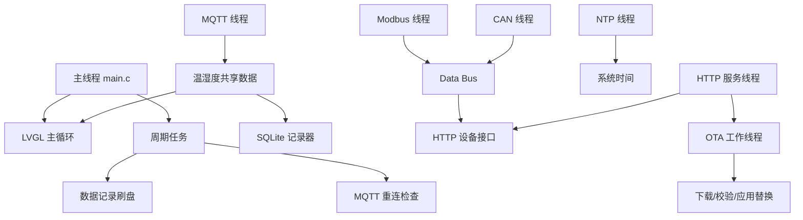

# 环境监测站（Environment Monitor）v3.1.4

## 1. 项目说明

本项目是运行在 RK3506G Linux 设备上的单进程 C 语言应用，负责环境数据接收、工业通信、屏幕显示、本地存储、HTTP 接口和应用程序 OTA 更新。

项目由本人独立负责和完成，包含架构设计、底层适配、通信模块、界面、数据库、Web 服务、OTA 和构建配置。

本文只记录当前代码中能够确认的能力，不把模拟数据、占位接口或文档描述当成已完成产品功能。

## 2. 已实现功能

- LVGL 图形界面，包含 MQTT、Modbus、CAN、OTA 四个页面。
- DRM 显示输出和 evdev 触摸输入。
- MQTT Broker 连接、订阅、重连和 JSON 温湿度消息解析。
- Modbus RTU 主站轮询和 CRC 校验。
- RS485 UART 半双工收发方向控制。
- SocketCAN 报文收发和信号提取。
- Modbus/CAN 数据写入 Data Bus，并通过 HTTP 查询当前数据。
- 温湿度数据批量写入 SQLite。
- HTTP 静态文件服务和当前状态接口。
- NTP 时间同步。
- 应用程序 OTA 下载、SHA256 校验、原子替换和健康检查回滚。
- ARM 目标构建配置和主机 SDL 模拟构建配置。

Modbus 页面默认只展示真实后台轮询结果；CAN 页面默认只展示真实接收结果。未实现的总线扫描、模拟寄存器读取、页面假自动轮询和 CAN Filter 控件已移除。测试发送控件只有在 `app_config.h` 显式开启时才生成。

以下内容不属于当前已实现功能：

- Web 历史数据接口已删除，不再返回随机模拟历史数据。
- 固件分区刷写 OTA 已删除，当前 OTA 仅支持应用程序更新。
- 数据断线补传未实现，当前只统计 MQTT 断开期间的记录数量。
- HTTPS、用户认证和完整数字签名校验未在当前代码中实现。
- 项目内没有 systemd 服务、SysV 启动脚本或独立守护进程。

## 3. 目录结构

```text
.
├── hal/                         Linux 硬件抽象层
│   ├── display_drm.c            DRM 显示
│   ├── display_sdl.c            主机模拟显示
│   ├── touch_evdev.c            evdev 触摸
│   ├── rs485_uart.c             RS485 UART
│   └── can_socket.c             SocketCAN
├── infra/                       基础设施
│   ├── logger.c                 日志
│   ├── sha256.c                 SHA256
│   └── watchdog.c               看门狗
├── services/                    业务服务
│   ├── mqtt_client.c            MQTT 客户端
│   ├── data_bus.c               数据总线
│   ├── data_recorder.c          数据记录器
│   ├── modbus_master.c           Modbus 主站
│   └── can_manager.c             CAN 管理器
├── storage/                     配置文件解析
├── ui/                          LVGL 页面
├── web/                         HTTP API 处理器
├── www/                         Web 静态页面
├── database.c                   SQLite 封装
├── ota_manager.c                应用 OTA
├── ntp_sync.c                   NTP 同步
├── web_server.c                 HTTP 服务
├── main.c                       程序入口
├── app_config.h                 统一配置
└── CMakeLists.txt               唯一构建入口
```

## 4. 总体架构



## 5. 启动和线程模型

### 5.1 启动顺序

`D:\rk3506WG-main\rk3506WG-main\main.c` 的启动流程为：

1. 注册 `SIGINT` 和 `SIGTERM` 处理。
2. 初始化日志、看门狗、显示和触摸。
3. 初始化 LVGL 并创建四个页面。
4. 写入 OTA 健康标记。
5. 延迟初始化数据库、HTTP、NTP、OTA、MQTT、Data Bus、Modbus 和 CAN。
6. 进入 LVGL 主循环。

### 5.2 线程

| 线程 | 工作内容 |
|---|---|
| 主线程 | LVGL、UI 更新、定时任务 |
| MQTT 线程 | Mosquitto 网络循环和消息回调 |
| Modbus 线程 | 周期性 RTU 轮询 |
| CAN 线程 | SocketCAN 报文接收和解析 |
| NTP 线程 | 网络时间同步 |
| HTTP 线程 | 接收 HTTP 连接 |
| HTTP 客户端线程 | 处理单个 HTTP 请求 |
| OTA 线程 | 更新检查、下载和校验 |
| OTA 更新 worker | 旧进程退出后的应用替换和回滚监控 |

所有 LVGL 对象更新都在主线程完成。MQTT/CAN 后台线程只写入受保护的数据或队列，不直接操作 LVGL。

## 6. MQTT

实现文件：

```text
D:\rk3506WG-main\rk3506WG-main\services\mqtt_client.c
```

启动流程为：

1. `mqtt_client_init()` 创建客户端并注册回调。
2. `mqtt_client_set_auth()` 在启动连接前设置认证信息。
3. `mqtt_client_start()` 发起异步连接并启动 Mosquitto 网络线程。
4. 连接成功后订阅 `MQTT_TOPIC`。
5. 收到消息后使用 cJSON 读取 `temperature`、`humidity` 和 `valid` 字段。

连接状态和重试次数使用原子变量保护。重连使用 Mosquitto 异步接口和退避策略。

## 7. Modbus RTU 和 RS485

实现文件：

```text
D:\rk3506WG-main\rk3506WG-main\services\modbus_master.c
D:\rk3506WG-main\rk3506WG-main\hal\rs485_uart.c
```

当前流程：

```text
构造 RTU 请求
    ↓
RS485 GPIO 切换为发送
    ↓
UART 写入并 tcdrain()
    ↓
GPIO 切换为接收
    ↓
接收响应并校验 CRC
    ↓
解析寄存器并发布到 Data Bus
```

响应帧会校验地址、功能码、异常码、响应长度、字节数和 CRC，避免因异常长度访问越界。

## 8. CAN

实现文件：

```text
D:\rk3506WG-main\rk3506WG-main\services\can_manager.c
D:\rk3506WG-main\rk3506WG-main\hal\can_socket.c
```

当前使用 Linux SocketCAN RAW socket，支持：

- CAN 接口初始化。
- 波特率配置。
- Socket 绑定。
- 报文接收和发送。
- 标准帧信号匹配。
- Intel 小端位提取。
- Data Bus 发布。

CAN 接收线程不会直接修改 LVGL，而是将最新原始帧复制到线程安全的 UI 待处理缓冲区，由主线程定时消费。

## 9. Data Bus

实现文件：

```text
D:\rk3506WG-main\rk3506WG-main\services\data_bus.c
```

限制：

- 最多 64 个数据点。
- 最多 16 个订阅者。
- 使用互斥锁保护点表和订阅者表。
- 发布时先在锁内复制数据和回调快照，再在锁外执行回调。

当前实际业务使用：

- Modbus 发布数据。
- CAN 发布数据。
- HTTP 读取最新数据。

MQTT 温湿度数据当前直接进入共享数据和记录器，没有伪造 Data Bus 订阅链路。

## 10. SQLite 存储

实现文件：

```text
D:\rk3506WG-main\rk3506WG-main\database.c
D:\rk3506WG-main\rk3506WG-main\services\data_recorder.c
```

数据库文件：

```text
sensor_data.db
```

记录器使用最多 120 条内存缓冲。刷盘时通过 SQLite 事务批量插入，只有整个批次提交成功后才清空内存缓冲，避免数据库失败时直接丢失记录。

记录器不提供 MQTT 断线补传。`offline_count` 只用于统计断开期间收到的记录数量。

## 11. HTTP 接口

服务文件：

```text
D:\rk3506WG-main\rk3506WG-main\web_server.c
```

默认端口：`8080`。

当前路由：

| 方法 | 路径 | 作用 |
|---|---|---|
| GET | `/api/sensor/current` | 当前温湿度 |
| GET | `/api/system/info` | 系统和 OTA 状态 |
| GET | `/api/health` | NTP、数据库、磁盘和运行状态 |
| GET | `/api/status` | MQTT、Modbus、CAN、OTA 汇总状态 |
| GET | `/api/device/list` | Data Bus 全部数据点 |
| GET | `/api/device/modbus` | Modbus 数据点 |
| GET | `/api/device/can` | CAN 数据点 |
| GET | `/api/ota/check` | 检查应用更新 |
| GET | `/api/ota/status` | 查询 OTA 状态 |
| POST | `/api/ota/start` | 启动应用 OTA |
| GET | `/` 及静态路径 | `www` 目录静态文件 |

HTTP 请求处理已支持：

- 分段接收请求头。
- `Content-Length` 请求体接收。
- 请求总长度限制。
- 超限返回 `413`。
- `send()` 短写循环处理。
- 活跃客户端数量限制。
- 服务停止时关闭监听 socket 并等待线程退出。

当前 HTTP 服务仍是明文 HTTP，仓库没有提供 HTTPS、用户认证或访问令牌配置。因此不能将它描述为安全的公网接口。

## 12. 应用 OTA

当前 OTA 只支持应用程序更新，不包含固件分区刷写。

实现文件：

```text
D:\rk3506WG-main\rk3506WG-main\ota_manager.c
```

更新流程：

1. 请求 `version.json`。
2. 比较应用版本号。
3. 下载应用文件或可用的差分补丁。
4. 校验 SHA256。
5. 创建 OTA worker。
6. worker 为旧程序创建 `.bak` 备份。
7. 将新程序复制到同目录临时文件并 `fsync()`。
8. 使用 `rename()` 原子覆盖切换到安装路径，并同步父目录。
9. 启动新程序。
10. 新程序写入健康标记。
11. 超过宽限期仍没有健康标记时终止新程序并恢复备份。

应用切换流程不再使用 shell 安装脚本，也不再通过 `system()` 执行 `cp`、`killall` 或启动命令。

## 13. 配置和日志

### 13.1 配置

配置文件实现：

```text
D:\rk3506WG-main\rk3506WG-main\storage\config_file.c
```

当前使用 cJSON 解析完整 JSON 对象，支持字符串、整数、浮点数和布尔值。字符串返回缓冲区为线程局部存储。

### 13.2 日志

日志默认写入：

```text
/tmp/my_test.log
```

日志达到 1 MiB 后轮转为：

```text
/tmp/my_test.log.1
```

日志写入由互斥锁保护，支持控制台和文件输出。

## 14. 构建

项目当前只保留一个构建入口：

```text
D:\rk3506WG-main\rk3506WG-main\CMakeLists.txt
```

### 14.1 主机模拟构建

需要本机安装 SDL2 的头文件和库：

```bash
cmake -S . -B build_host -DHOST_SIMULATION=ON
cmake --build build_host
```

主机模式使用：

- SDL2 显示。
- RS485 stub。
- CAN stub。
- MQTT 模拟数据源。
- NTP、HTTP、数据库、OTA 和看门狗 stub。

主机模拟不能证明真实设备驱动和外设通信正常。

### 14.2 ARM 构建

目标构建使用 CMake 中的 ARM 分支，需要提供：

- `SDK_ROOT`。
- `SYSROOT`。
- ARM 交叉编译器。
- 目标系统中的 LVGL、Mosquitto、DRM、cJSON 等依赖。

目标编译选项包含：

```text
-march=armv7-a
-mfloat-abi=hard
-mfpu=neon
```

## 15. 本次修复内容

本次针对代码中已确认的问题完成以下修改：

1. 记录器移除锁重入，改为事务式批量写入。
2. 数据库批次失败时保留内存记录。
3. Data Bus 回调移到互斥锁外执行。
4. MQTT、Modbus、CAN、NTP、看门狗和 HTTP 状态变量增加同步保护。
5. 传感器共享变量增加互斥锁。
6. CAN 原始帧改为主线程消费，避免后台线程调用 LVGL。
7. MQTT 认证设置顺序调整为连接启动前完成。
8. HTTP 改为循环接收完整请求，并校验请求体长度。
9. HTTP 发送支持短写，限制活跃客户端数量。
10. HTTP OTA 检查加入并发锁，服务停止等待客户端线程退出。
11. 删除 Web 历史随机数据接口。
12. OTA 应用替换改为 worker、临时文件、`fsync()` 和 `rename()`。
13. OTA 更新不再使用 shell 安装脚本切换应用。
14. 删除未实现的固件刷写 OTA 分支。
15. 配置解析改为 cJSON，移除共享静态解析缓冲区。
16. 日志增加 1 MiB 文件轮转。
17. 增加服务、线程、看门狗、DRM、触摸和 RS485 的退出清理路径。
18. 移除未实现的总线扫描、模拟寄存器、假自动轮询和 CAN Filter 控件。
19. 统一版本来源为 `app_config.h` 中的 `APP_VERSION`。
20. 删除重复且互相不一致的 `CMakeLists_host.txt`。

## 16. 验证说明

已执行：

- CMake 主机配置检查。
- Data Bus、数据记录器、数据库、Modbus、CAN、MQTT stub、看门狗等源文件的语法检查。

当前分析环境没有 SDL2 头文件和库，因此完整主机链接构建无法在该环境中完成；CMake 已改为自动查找 SDL2，缺少依赖时明确报错。

ARM 目标构建需要项目外部 SDK、sysroot 和目标设备依赖，当前环境没有这些外部条件，因此未声明 ARM 构建通过。

## 17. 项目结论

这是一个由本人独立完成的嵌入式 Linux 环境监测应用，当前实际能力集中在：

- MQTT 数据接收。
- Modbus/CAN 工业通信。
- LVGL 本地显示。
- SQLite 本地存储。
- HTTP 当前状态和设备数据接口。
- 应用程序 OTA 更新和失败回滚。

文档和代码已经删除随机历史数据、固件刷写 OTA、重复主机构建配置等不应继续对外描述的内容。
